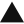

<p align="center">

```aura width=860 height=200
<div style={{
  width: '100%', height: '100%', background: '#D9D2BE',
  display: 'flex', padding: 12, boxSizing: 'border-box', fontFamily: 'BrutalMono',
}}>
  <div style={{
    flex: 1, display: 'flex', flexDirection: 'row', alignItems: 'center',
    background: '#F4EBDD', border: '3px solid #111111',
    boxShadow: '8px 8px 0 #111111', padding: '14px 18px',
    position: 'relative', overflow: 'hidden', gap: 16,
  }}>
    <div style={{ position: 'absolute', top: 0, right: 0, width: 44, height: 44, background: '#111111', display: 'flex' }}>
      <div style={{ width: 12, height: 12, background: '#FFD60A', margin: 7 }} />
    </div>

    

    <div style={{ display: 'flex', flexDirection: 'column', gap: 8, minWidth: 0 }}>
      <div style={{
        display: 'flex', fontSize: 32, color: '#111111',
        fontFamily: 'BrutalMonoBold', letterSpacing: '-1px',
        background: '#FFD60A', border: '3px solid #111111',
        boxShadow: '4px 4px 0 #111111', padding: '4px 12px',
      }}>
        {(github.user.name || github.user.login).toUpperCase()}
      </div>
      <div style={{ display: 'flex', fontSize: 13, color: '#111111' }}>
        {github.user.bio || 'Full Stack Developer · Building clean, fast, modern web experiences'}
      </div>
      <div style={{ display: 'flex', gap: 8, marginTop: 2 }}>
        {['Full-Stack', 'React', 'Next.js', 'TypeScript'].map(function(tag) {
          return (
            <div key={tag} style={{
              display: 'flex', padding: '4px 10px',
              background: '#FFFDF5', border: '2px solid #111111',
              boxShadow: '3px 3px 0 #111111',
              color: '#111111', fontSize: 11, letterSpacing: '0.5px',
            }}>{tag.toUpperCase()}</div>
          );
        })}
      </div>
    </div>
  </div>
</div>
```

</p>

<br>

```aura width=860 height=140
(function() {
  var stats = [
    { label: 'Repos', value: String(github.stats.totalRepos), color: '#FFD60A' },
    { label: 'Stars', value: String(github.stats.totalStars), color: '#00E5FF' },
    { label: 'Commits', value: String(github.stats.totalCommits), color: '#FF4D6D' },
  ];

  return (
    <div style={{
      width: '100%', height: '100%', background: '#D9D2BE',
      display: 'flex', padding: 12, boxSizing: 'border-box', fontFamily: 'BrutalMono',
    }}>
      <div style={{
        flex: 1, display: 'flex', alignItems: 'stretch',
        background: '#F4EBDD', border: '3px solid #111111',
        boxShadow: '8px 8px 0 #111111', padding: '10px 0',
      }}>
        {stats.map(function(s, i) {
          return (
            <div key={s.label} style={{
              flexGrow: 1, display: 'flex', flexDirection: 'column',
              alignItems: 'center', justifyContent: 'center', gap: 8,
              borderRight: i < stats.length - 1 ? '3px solid #111111' : 'none',
            }}>
              <div style={{
                display: 'flex', fontSize: 34, color: '#111111',
                fontFamily: 'BrutalMonoBold', lineHeight: 1,
                background: s.color, border: '3px solid #111111',
                boxShadow: '5px 5px 0 #111111', padding: '2px 18px',
              }}>{s.value}</div>
              <div style={{
                display: 'flex', fontSize: 11, color: '#111111',
                letterSpacing: '2px', marginTop: 6,
              }}>{s.label.toUpperCase()}</div>
            </div>
          );
        })}
      </div>
    </div>
  );
})()
```

<br>

```aura width=860 height=290
(function() {
  var categories = [
    { title: 'Languages', color: '#FFD60A', items: ['JavaScript', 'TypeScript', 'Python', 'Java', 'Go'] },
    { title: 'Frontend', color: '#00E5FF', items: ['React', 'Next.js', 'Tailwind CSS', 'Bootstrap'] },
    { title: 'Backend', color: '#FF4D6D', items: ['Node.js', 'Express.js', 'GraphQL'] },
    { title: 'Databases', color: '#B7F01E', items: ['MongoDB', 'Redis', 'SQL'] },
    { title: 'DevOps & Cloud', color: '#FF6B35', items: ['Docker', 'Kubernetes', 'Git'] },
    { title: 'Tools & Design', color: '#FFD60A', items: ['Figma', 'VS Code', 'Postman'] },
  ];

  return (
    <div style={{
      width: '100%', height: '100%', background: '#D9D2BE',
      display: 'flex', padding: 12, boxSizing: 'border-box', fontFamily: 'BrutalMono',
    }}>
      <div style={{
        flex: 1, display: 'flex', flexDirection: 'column', gap: 9,
        background: '#F4EBDD', border: '3px solid #111111',
        boxShadow: '8px 8px 0 #111111', padding: '14px 18px',
      }}>
        <div style={{ display: 'flex', alignItems: 'center', gap: 10, marginBottom: 2 }}>
          <div style={{ width: 14, height: 14, background: '#111111' }} />
          <div style={{
            display: 'flex', fontSize: 16, color: '#111111',
            fontFamily: 'BrutalMonoBold', letterSpacing: '2px', background: '#FFD60A',
            border: '2px solid #111111', boxShadow: '3px 3px 0 #111111', padding: '3px 10px',
          }}>TECH STACK</div>
        </div>
        <div style={{ display: 'flex', flexDirection: 'column', gap: 6 }}>
          {categories.map(function(cat) {
            return (
              <div key={cat.title} style={{ display: 'flex', alignItems: 'center', gap: 10 }}>
                <div style={{
                  display: 'flex', fontSize: 10, color: '#111111',
                  fontFamily: 'BrutalMonoBold', letterSpacing: '1px', width: 118,
                  padding: '5px 8px', background: cat.color, border: '2px solid #111111',
                  boxShadow: '3px 3px 0 #111111', justifyContent: 'center', flexShrink: 0,
                }}>{cat.title.toUpperCase()}</div>
                <div style={{ display: 'flex', flexWrap: 'wrap', gap: 6 }}>
                  {cat.items.map(function(item) {
                    return (
                      <div key={item} style={{
                        display: 'flex', padding: '3px 9px',
                        background: '#FFFDF5', border: '2px solid #111111',
                        boxShadow: '2px 2px 0 #111111',
                        color: '#111111', fontSize: 11,
                      }}>{item}</div>
                    );
                  })}
                </div>
              </div>
            );
          })}
        </div>
      </div>
    </div>
  );
})()
```

<br>

```aura width=860 height=200
<div style={{
  width: '100%', height: '100%', background: '#D9D2BE',
  display: 'flex', padding: 12, boxSizing: 'border-box', fontFamily: 'BrutalMono',
}}>
  <div style={{
    flex: 1, display: 'flex', flexDirection: 'column', gap: 12,
    background: '#F4EBDD', border: '3px solid #111111',
    boxShadow: '8px 8px 0 #111111', padding: '14px 18px',
  }}>
    <div style={{ display: 'flex', alignItems: 'center', gap: 10 }}>
      <div style={{ width: 14, height: 14, background: '#FF4D6D' }} />
      <div style={{
        display: 'flex', fontSize: 16, color: '#111111',
        fontFamily: 'BrutalMonoBold', letterSpacing: '2px', background: '#00E5FF',
        border: '2px solid #111111', boxShadow: '3px 3px 0 #111111', padding: '3px 10px',
      }}>TOP PROJECTS</div>
    </div>
    <div style={{ display: 'flex', flexWrap: 'wrap', gap: 12, marginTop: 2 }}>
      {[
        { name: 'TluxAi', desc: 'AI Embedding Pipeline', url: 'https://github.com/tanushpatel-git/Ai-Embedding-Tlux.git', color: '#FFD60A' },
        { name: 'CodeEra', desc: 'Collaborative Coding Platform', url: 'https://github.com/tanushpatel-git/CodeEra.git', color: '#00E5FF' },
        { name: 'Topmate', desc: '1-on-1 Mentorship Platform', url: 'https://github.com/tanushpatel-git/Topmate-1-1-.git', color: '#FF4D6D' },
        { name: 'Github_tanu', desc: 'GitHub Profile Tools', url: 'https://github.com/tanushpatel-git/Github_tanu.git', color: '#B7F01E' },
      ].map(function(p) {
        return (
          <a key={p.name} href={p.url} style={{ textDecoration: 'none' }}>
            <div style={{
              display: 'flex', flexDirection: 'column', gap: 5,
              padding: '10px 12px 12px', width: 185, minWidth: 185,
              background: '#FFFDF5', border: '2px solid #111111',
              boxShadow: '4px 4px 0 #111111', position: 'relative',
            }}>
              <div style={{ position: 'absolute', top: 0, left: 0, right: 0, height: 6, background: p.color }} />
              <div style={{
                display: 'flex', fontSize: 14, color: '#111111',
                fontFamily: 'BrutalMonoBold', marginTop: 4,
              }}>{p.name.toUpperCase()}</div>
              <div style={{
                display: 'flex', fontSize: 10, color: '#111111', opacity: 0.7,
              }}>{p.desc}</div>
            </div>
          </a>
        );
      })}
    </div>
  </div>
</div>
```

<br>

```aura width=860 height=200
(function() {
  var days = ['Sun', 'Mon', 'Tue', 'Wed', 'Thu', 'Fri', 'Sat'];
  var today = new Date();
  var dayLabels = [];
  var heights = [18, 42, 35, 58, 24, 66, 48, 72, 30, 55, 80, 44, 62, 90, 38];
  var colors = ['#FFD60A', '#00E5FF', '#FF4D6D', '#B7F01E', '#FF6B35'];
  for (var i = 14; i >= 0; i--) {
    var d = new Date(today);
    d.setDate(d.getDate() - i);
    dayLabels.push(days[d.getDay()] + ' ' + d.getDate());
  }

  return (
    <div style={{
      width: '100%', height: '100%', background: '#D9D2BE',
      display: 'flex', padding: 12, boxSizing: 'border-box', fontFamily: 'BrutalMono',
    }}>
      <div style={{
        flex: 1, display: 'flex', flexDirection: 'column', gap: 8,
        background: '#F4EBDD', border: '3px solid #111111',
        boxShadow: '8px 8px 0 #111111', padding: '12px 18px',
      }}>
        <div style={{ display: 'flex', alignItems: 'center', gap: 10 }}>
          <div style={{ width: 14, height: 14, background: '#B7F01E' }} />
          <div style={{
            display: 'flex', fontSize: 14, color: '#111111',
            fontFamily: 'BrutalMonoBold', letterSpacing: '2px', background: '#FF4D6D',
            border: '2px solid #111111', boxShadow: '3px 3px 0 #111111', padding: '2px 10px',
          }}>LAST 15 DAYS</div>
        </div>
        <div style={{
          display: 'flex', justifyContent: 'center', alignItems: 'flex-end',
          gap: 10, marginTop: 2, height: 104,
        }}>
          {heights.map(function(h, i) {
            var isMax = h === 90;
            return (
              <div key={i} style={{
                display: 'flex', flexDirection: 'column', alignItems: 'center', gap: 4, width: 38,
              }}>
                <div style={{
                  display: 'flex', fontSize: 9, color: '#111111',
                }}>{h}</div>
                <div style={{
                  width: 24, height: Math.round(h * 0.75),
                  background: isMax ? '#FFD60A' : colors[i % 5],
                  border: '2px solid #111111',
                  boxShadow: isMax ? '4px 4px 0 #111111' : '3px 3px 0 #111111',
                }} />
                <div style={{
                  fontSize: 8, color: '#111111', opacity: 0.75,
                  letterSpacing: '0.5px', textAlign: 'center', marginTop: 2,
                  whiteSpace: 'nowrap',
                }}>{dayLabels[i]}</div>
              </div>
            );
          })}
        </div>
      </div>
    </div>
  );
})()
```

<br>

<p align="center">

```aura width=120 height=44 link="https://github.com/tanushpatel-git" inline align=center
<div style={{
  width: '100%', height: '100%', background: '#111111', display: 'flex',
}}>
  <div style={{
    width: '100%', height: '100%',
    background: '#FFD60A', border: '3px solid #111111', boxSizing: 'border-box',
    transform: 'translate(-4px, -4px)',
    display: 'flex', alignItems: 'center', justifyContent: 'center', gap: 5,
    padding: '0 8px', fontFamily: 'BrutalMonoBold',
  }}>
    
    <span style={{ fontSize: 12, color: '#111111', letterSpacing: '0.5px' }}>GITHUB</span>
  </div>
</div>
```

```aura width=130 height=44 link="https://tanushportfolioo.netlify.app" inline align=center
<div style={{
  width: '100%', height: '100%', background: '#111111', display: 'flex',
}}>
  <div style={{
    width: '100%', height: '100%',
    background: '#00E5FF', border: '3px solid #111111', boxSizing: 'border-box',
    transform: 'translate(-4px, -4px)',
    display: 'flex', alignItems: 'center', justifyContent: 'center', gap: 5,
    padding: '0 8px', fontFamily: 'BrutalMonoBold',
  }}>
    
    <span style={{ fontSize: 12, color: '#111111', letterSpacing: '0.5px' }}>PORTFOLIO</span>
  </div>
</div>
```

```aura width=110 height=44 link="https://wa.me/919729348173" inline align=center
<div style={{
  width: '100%', height: '100%', background: '#111111', display: 'flex',
}}>
  <div style={{
    width: '100%', height: '100%',
    background: '#B7F01E', border: '3px solid #111111', boxSizing: 'border-box',
    transform: 'translate(-4px, -4px)',
    display: 'flex', alignItems: 'center', justifyContent: 'center', gap: 5,
    padding: '0 8px', fontFamily: 'BrutalMonoBold',
  }}>
    
    <span style={{ fontSize: 12, color: '#111111', letterSpacing: '0.5px' }}>WHATSAPP</span>
  </div>
</div>
```

```aura width=110 height=44 link="mailto:tanush000patel@gmail.com" inline align=center
<div style={{
  width: '100%', height: '100%', background: '#111111', display: 'flex',
}}>
  <div style={{
    width: '100%', height: '100%',
    background: '#FF4D6D', border: '3px solid #111111', boxSizing: 'border-box',
    transform: 'translate(-4px, -4px)',
    display: 'flex', alignItems: 'center', justifyContent: 'center', gap: 5,
    padding: '0 8px', fontFamily: 'BrutalMonoBold',
  }}>
    
    <span style={{ fontSize: 12, color: '#111111', letterSpacing: '0.5px' }}>EMAIL</span>
  </div>
</div>
```

</p>
